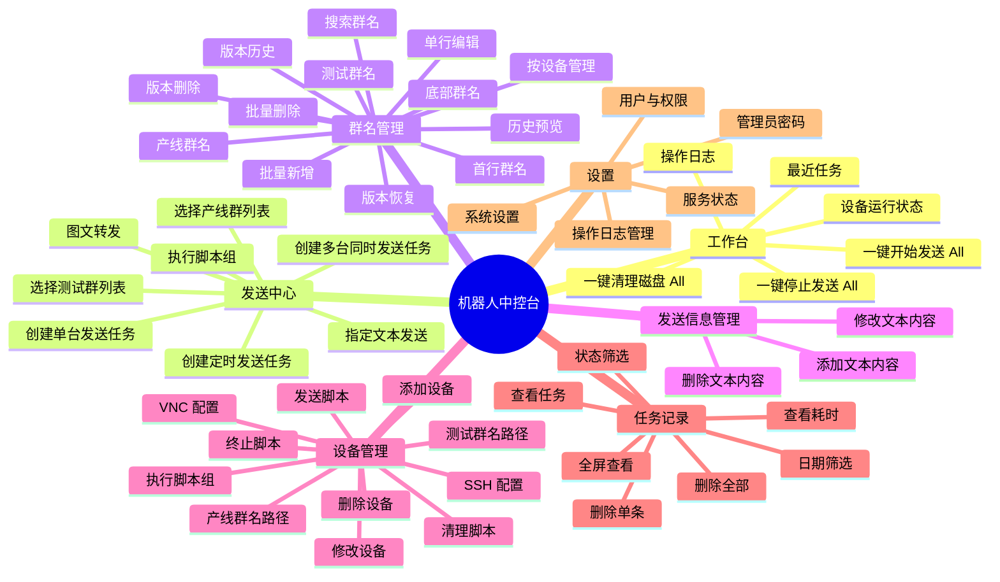
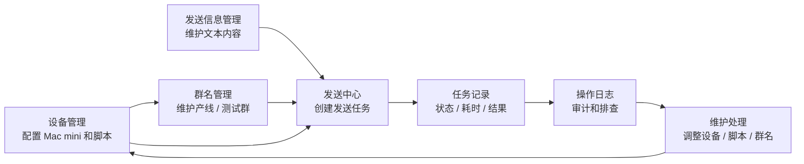
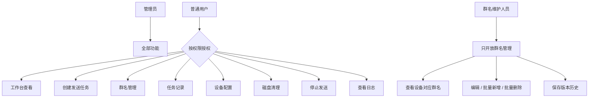
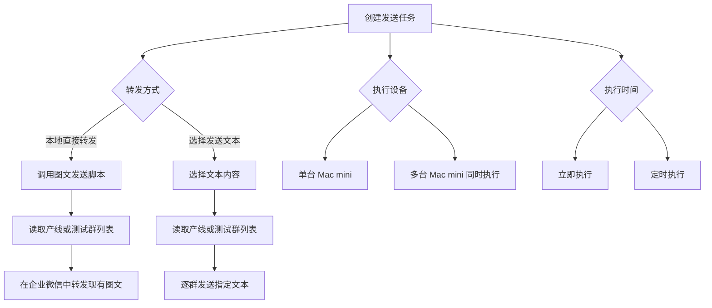
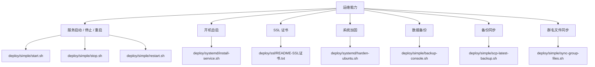

# 功能图

本文按页面和业务功能梳理“机器人中控台”的功能范围，适合产品交接、培训和验收使用。

## 1. 总体功能图

```mermaid
mindmap
  root((机器人中控台))
    工作台
      设备运行状态
      最近任务
      操作日志
      一键清理磁盘 All
      一键开始发送 All
      一键停止发送 All
    发送中心
      创建单台发送任务
      创建多台同时发送任务
      创建定时发送任务
      选择产线群列表
      选择测试群列表
      图文转发
      指定文本发送
      执行脚本组
    群名管理
      按设备管理
      产线群名
      测试群名
      搜索群名
      单行编辑
      批量新增
      批量删除
      首行群名
      底部群名
      版本历史
      历史预览
      版本恢复
      版本删除
    发送信息管理
      添加文本内容
      修改文本内容
      删除文本内容
    设备管理
      添加设备
      修改设备
      删除设备
      SSH 配置
      VNC 配置
      发送脚本
      终止脚本
      清理脚本
      产线群名路径
      测试群名路径
      执行脚本组
    任务记录
      查看任务
      查看耗时
      状态筛选
      日期筛选
      全屏查看
      删除单条
      删除全部
    设置
      用户与权限
      管理员密码
      系统设置
      服务状态
      操作日志管理
```

## 2. 页面功能关系图

```mermaid
flowchart TB
    A[工作台] --> A1[查看设备状态]
    A --> A2[快速执行设备操作]
    A --> A3[查看最近任务和操作日志]

    B[发送中心] --> B1[选择转发方式]
    B1 --> B11[本地直接图文转发]
    B1 --> B12[选择文本内容发送]
    B --> B2[选择执行设备]
    B --> B3[选择产线或测试群列表]
    B --> B4[选择执行脚本]
    B --> B5[立即执行或定时执行]

    C[群名管理] --> C1[读取设备群名路径]
    C --> C2[维护产线群名]
    C --> C3[维护测试群名]
    C --> C4[保存并生成版本]
    C --> C5[预览 / 恢复 / 删除历史版本]

    D[设备管理] --> D1[设备 SSH 信息]
    D --> D2[设备脚本路径]
    D --> D3[群名文件路径]
    D --> D4[执行脚本组]
    D --> D5[VNC 远程桌面]

    E[设置] --> E1[用户管理]
    E --> E2[权限授权]
    E --> E3[管理员密码]
    E --> E4[系统运行参数]
```

## 3. 核心业务闭环

```mermaid
flowchart LR
    Device[设备管理<br/>配置 Mac mini 和脚本] --> Group[群名管理<br/>维护产线 / 测试群]
    Message[发送信息管理<br/>维护文本内容] --> Send[发送中心<br/>创建发送任务]
    Group --> Send
    Device --> Send
    Send --> Task[任务记录<br/>状态 / 耗时 / 结果]
    Task --> Log[操作日志<br/>审计和排查]
    Log --> Maintain[维护处理<br/>调整设备 / 脚本 / 群名]
    Maintain --> Device
```

## 4. 角色权限功能图

```mermaid
flowchart TB
    Admin[管理员] --> All[全部功能]

    User[普通用户] --> Perm{按权限授权}
    Perm --> P1[工作台查看]
    Perm --> P2[创建发送任务]
    Perm --> P3[群名管理]
    Perm --> P4[任务记录]
    Perm --> P5[设备配置]
    Perm --> P6[磁盘清理]
    Perm --> P7[停止发送]
    Perm --> P8[查看日志]

    GroupUser[群名维护人员] --> G1[只开放群名管理]
    G1 --> G2[查看设备对应群名]
    G1 --> G3[编辑 / 批量新增 / 批量删除]
    G1 --> G4[保存版本历史]
```

## 5. 发送方式功能图

```mermaid
flowchart TB
    SendTask[创建发送任务] --> Mode{转发方式}

    Mode -->|本地直接转发| Local[调用图文发送脚本]
    Local --> LocalList[读取产线或测试群列表]
    LocalList --> LocalRun[在企业微信中转发现有图文]

    Mode -->|选择发送文本| Text[选择文本内容]
    Text --> TextList[读取产线或测试群列表]
    TextList --> TextRun[逐群发送指定文本]

    SendTask --> Device{执行设备}
    Device --> Single[单台 Mac mini]
    Device --> Multi[多台 Mac mini 同时执行]

    SendTask --> Time{执行时间}
    Time --> Now[立即执行]
    Time --> Schedule[定时执行]
```

## 6. 运维功能图

```mermaid
flowchart TB
    Ops[运维能力] --> O1[服务启动 / 停止 / 重启]
    Ops --> O2[开机自启]
    Ops --> O3[SSL 证书]
    Ops --> O4[系统加固]
    Ops --> O5[数据备份]
    Ops --> O6[备份同步]
    Ops --> O7[群名文件同步]

    O1 --> S1[deploy/simple/start.sh]
    O1 --> S2[deploy/simple/stop.sh]
    O1 --> S3[deploy/simple/restart.sh]
    O2 --> S4[deploy/systemd/install-service.sh]
    O3 --> S5[deploy/ssl/README-SSL证书.txt]
    O4 --> S6[deploy/systemd/harden-ubuntu.sh]
    O5 --> S7[deploy/simple/backup-console.sh]
    O6 --> S8[deploy/simple/scp-latest-backup.sh]
    O7 --> S9[deploy/simple/sync-group-files.sh]
```

